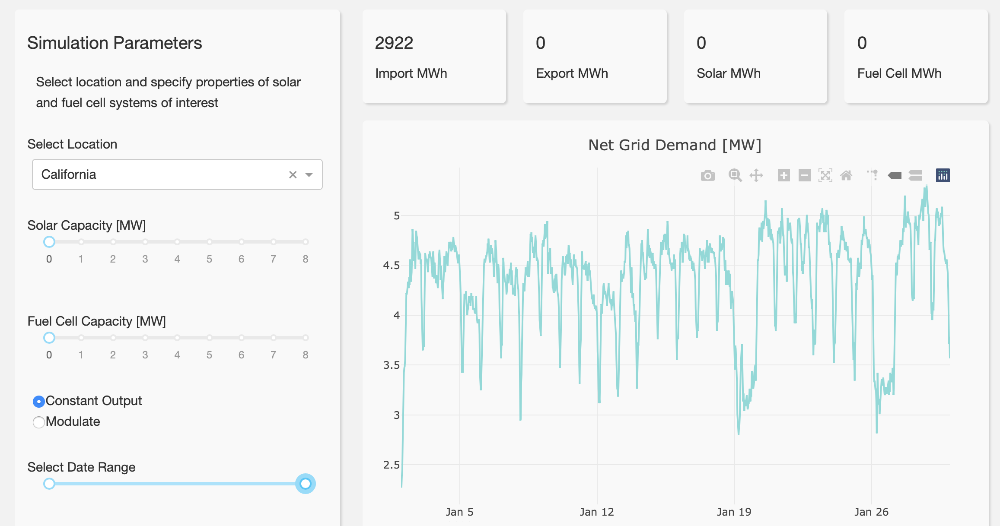
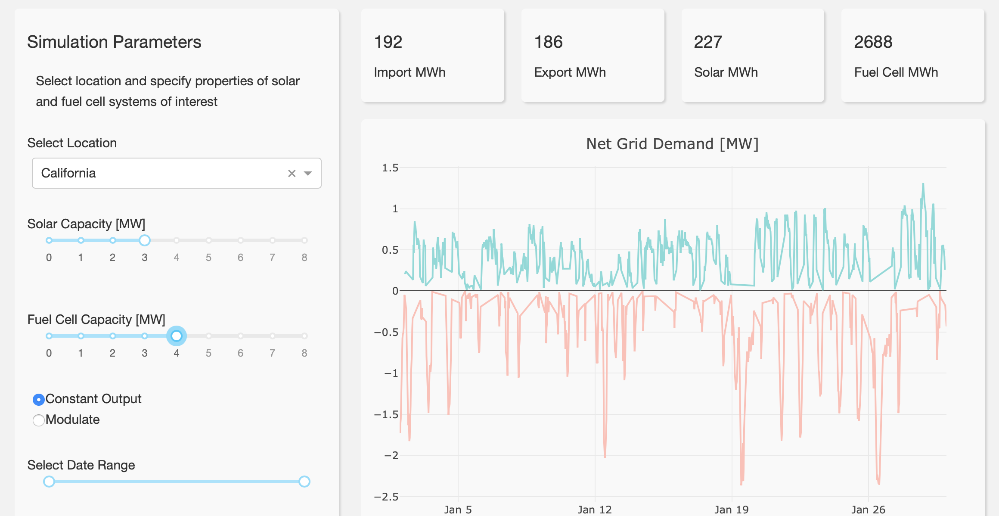
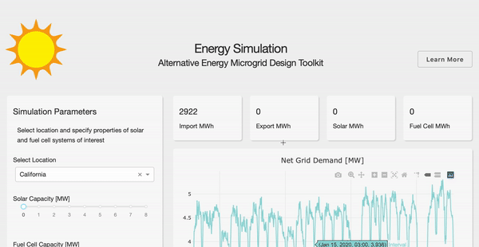

# Energy Simulation Web Application

### Alternative Energy Microgrid Design Toolkit

Demonstration of an interactive Python app used to simulate the net energy load (e.g. residential or commercial buildings) for different combinations of alternative enrgy technologies, such as solar and fuel cells. 

The goal is to determine the optimal size of solar and fuel cell systems to minimize the amount of imported energy from the grid. 

**Check out the app:** (https://my-dash-app-npr.herokuapp.com)
 
## Built With

#### Back-end

- [PostgreSQL](https://www.postgresql.org) - Relational database to store data used by the web-app (Heroku PostgreSQL add-on used for online version) 
- [psycopg2](https://pypi.org/project/psycopg2/) - Python adapter for PostgreSQL database communication
- [Pandas](https://pandas.pydata.org) - Cleaning and wrangling data from different sources to be used as input into the simulation
- [NREL Python API](https://sam.nrel.gov/software-development-kit-sdk/pysam.html) - Calculate solar irradiance and power generation based on geographical, environmental and system parameters

#### Front-end

- [Dash Plotly](https://dash.plot.ly/) - Used to create interactive dashboard
- [Heroku](https://www.heroku.com) - Web-app deployed on Heroko  

## Screenshots

The following are screenshots for the app in this repo:

